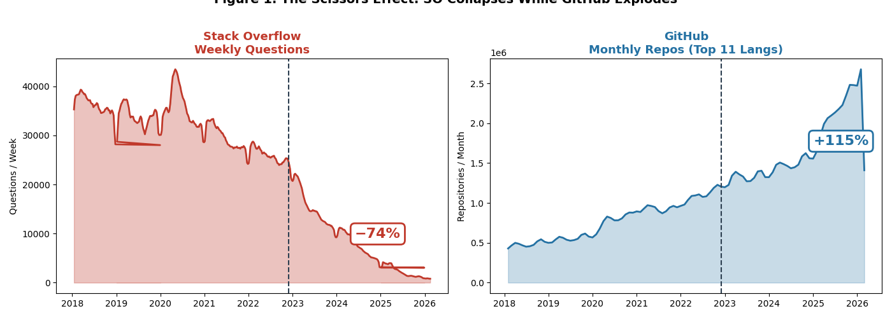
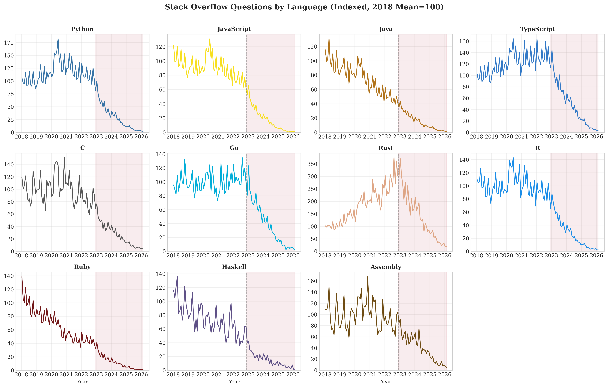
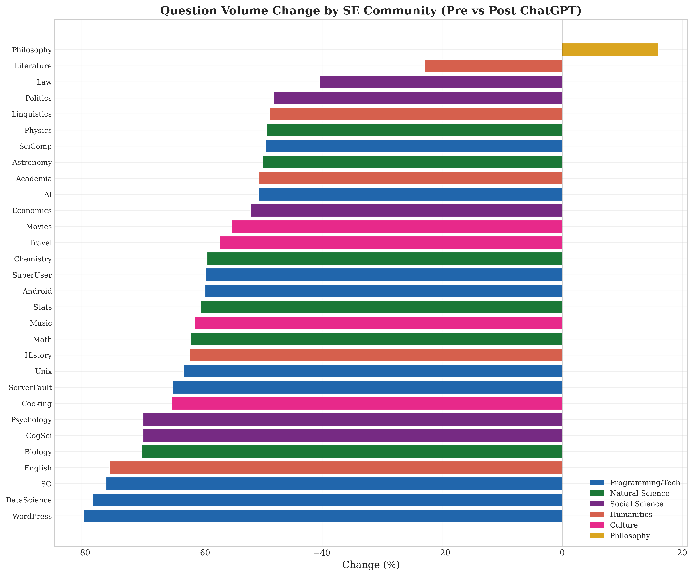
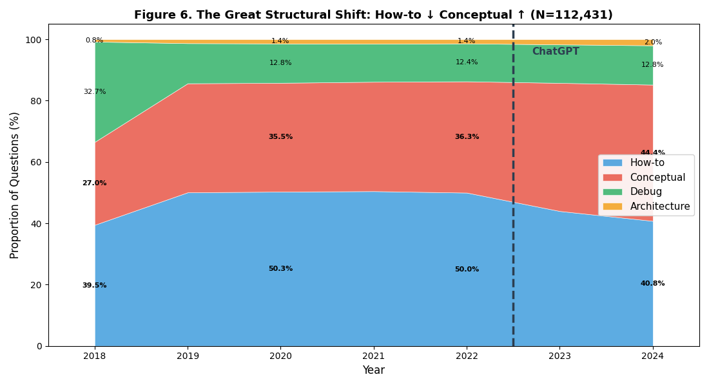
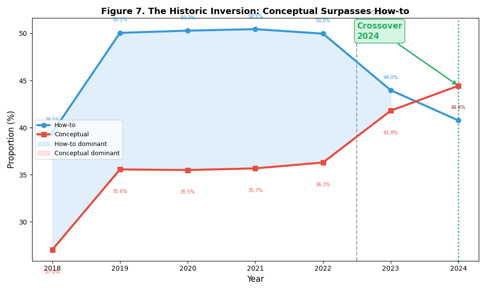
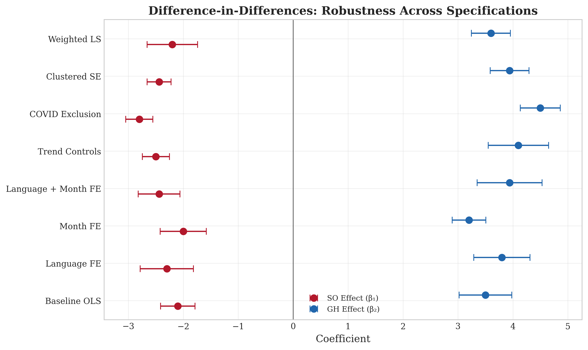
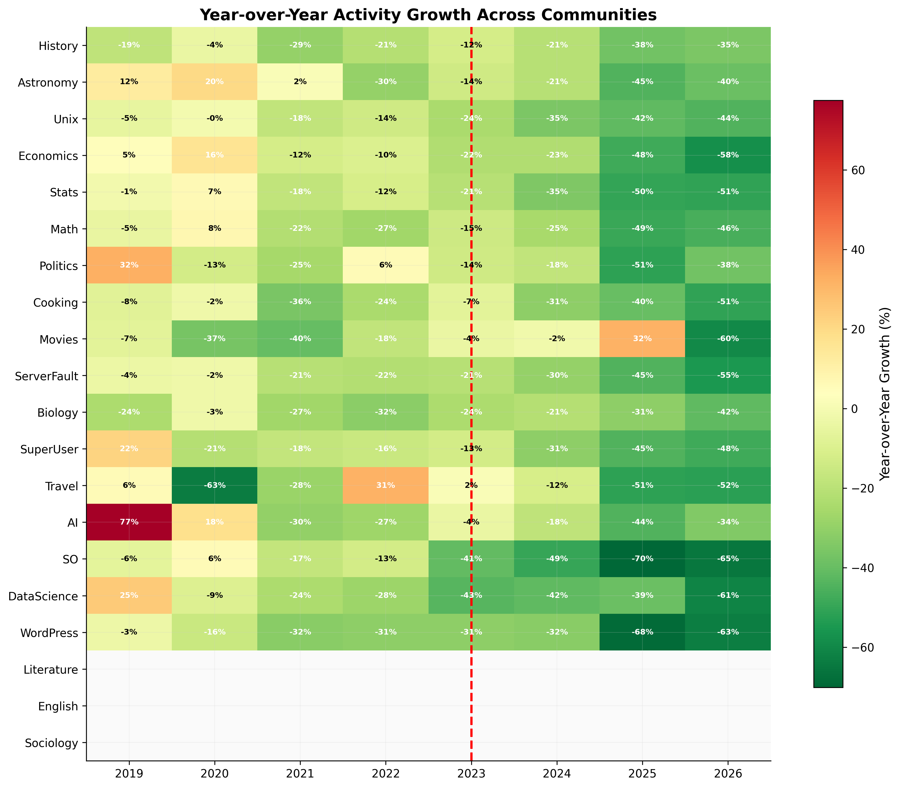
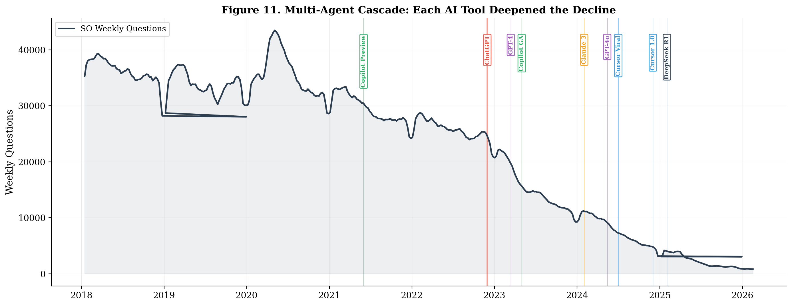
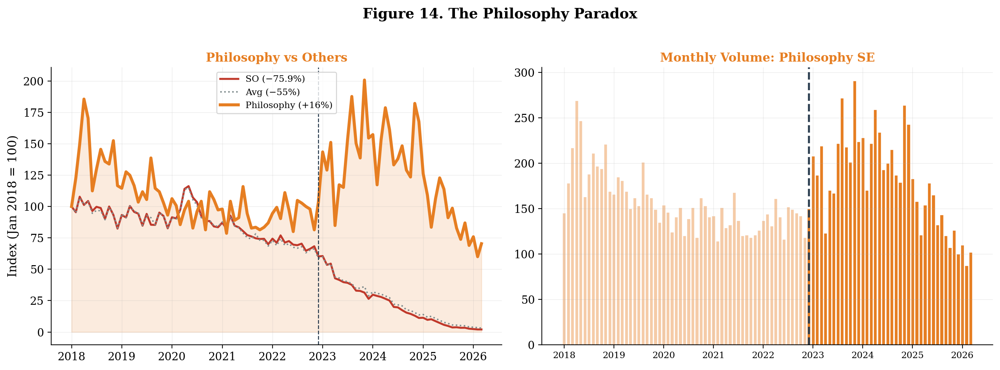

<div align="center">

# 🤖 The Disruption of Knowledge Ecosystems by Generative AI

### *Evidence from Stack Overflow, GitHub, and 31 Stack Exchange Communities (2018–2026)*


<br><br>

**Bingkun Zhao** · **Hongyu Chen** · **Beining Bao** · **Maolin Wang\***

<br>

🏛️ *Hong Kong Institute of AI for Science (HKAI-Sci)*
<br>
🎓 *City University of Hong Kong*

<br>

[](https://github.com/BKZhao/ai-knowledge-ecosystem)
[](latex/main.tex)
[](src/analysis/)
[](#data-overview)

</div>

---

## 📊 Key Findings at a Glance

<table>
<tr>
<td width="50%">

### ✂️ The Scissors Effect


Stack Overflow collapsed while GitHub exploded post-ChatGPT

</td>
<td width="50%">

### 🔄 The Historic Inversion


Conceptual questions surpassed How-to for the first time in 2024

</td>
</tr>
<tr>
<td>

### 🏛️ Cross-Domain Impact


30 of 31 SE communities declined significantly

</td>
<td>

### 🤯 The Philosophy Paradox


The sole community that GREW — humans seek answers AI cannot provide

</td>
</tr>
<tr>
<td>

### 📉 ARI Irrelevance


AI replaceability does NOT predict decline magnitude

</td>
<td>

### ⚡ Multi-Agent Cascade


Copilot → ChatGPT → GPT-4 → Claude → Cursor → DeepSeek = compounding disruption

</td>
</tr>
</table>

---

## 📸 Selected Figures

| Fig 01: ✂️ Scissors Effect | Fig 02: 📉 Language Panel | Fig 09: 🌍 31 Communities |
|:---:|:---:|:---:|
|  |  |  |
| SO vs GitHub divergence | All 11 languages declined | 30 declined, Philosophy grew |

| Fig 06: 📊 Classification | Fig 07: 🔄 Crossover | Fig 13: 📐 DID Robustness |
|:---:|:---:|:---:|
|  |  |  |
| How-to → Conceptual shift | Historic 2024 inversion | Robust across 7 models |

| Fig 03: 🔥 Heatmap | Fig 11: ⚡ AI Timeline | Fig 14: 🏛️ Philosophy |
|:---:|:---:|:---:|
|  |  |  |
| Synchronized collapse | Multi-agent cascade | The meta-inquiry shift |

<details>
<summary><b>🖼️ View All 22 Figures</b></summary>

| # | Figure | Key Insight |
|---|--------|-------------|
| 01 | ✂️ Scissors Effect | SO −75.9% vs GitHub +138.7% |
| 02 | 📉 Language Panel | All 11 languages declined |
| 03 | 🔥 Activity Heatmap | Synchronized post-ChatGPT collapse |
| 04 | 📉 Quality Dilution | Longer questions, fewer answers |
| 05 | 💥 GitHub Explosion | Python/TS led the surge |
| 06 | 📊 Classification | How-to → Conceptual shift |
| 07 | 🔄 Crossover | Historic inversion in 2024 |
| 08 | 🤯 ARI Irrelevance | r = −0.02, p = 0.74 |
| 09 | 🌍 31 Communities | Universal decline |
| 10 | 📊 Domain Impact | Programming hit hardest |
| 11 | ⚡ AI Timeline | Multi-agent cascade |
| 12 | 📈 Acceleration | Decline worsens each year |
| 13 | 📐 DID Robustness | 7 model specifications |
| 14 | 🏛️ Philosophy Paradox | Sole growing community |
| 15 | 🐛 Debug Collapse | Pre-ChatGPT IDE substitution |
| 16 | 🔍 Google Trends | Search tracks SO decline |
| 17 | 💊 Placebo Test | True effect 3+ SD from null |
| 18 | 📊 GitHub Pre/Post | TypeScript +231% |
| 19 | 📊 Event Study | Gradual treatment buildup |
| 20 | 📏 Quality Paradox | Length ↑, Answer rate ↓ |
| 21 | ✅ Robustness Checks | COVID exclusion, staggered |
| 22 | 📉 GitHub Engagement | Issues/repo declining |

</details>

---

## 🔬 Research Design

### 🧠 Theoretical Framework: DKB / AKB

```
┌─────────────────────────────────────────────────────────┐
│                                                         │
│   📚 Declarative Knowledge Bases (DKBs)                │
│   Stack Overflow · SE Communities                      │
│   → Natural language Q&A                               │
│   → AI substitutes via instant answers                  │
│   → Result: DECLINE ↓                                  │
│                                                         │
│   ⚙️ Algorithmic Knowledge Bases (AKBs)                │
│   GitHub Repositories                                  │
│   → Executable code                                    │
│   → AI expands via code generation                     │
│   → Result: GROWTH ↑                                   │
│                                                         │
└─────────────────────────────────────────────────────────┘
```

### 🔁 Three Mechanisms

| Mechanism | Description | Evidence |
|-----------|-------------|----------|
| **🔄 Substitution** | AI provides instant answers → less need to ask | SO −75.9% |
| **⚡ Activation** | AI lowers creation barriers → more code | GitHub +138.7% |
| **💧 Dilution** | Remaining questions harder → fewer answers → death spiral | Answer rate ↓ |

### 📐 Empirical Strategy

**Primary:** Stacked Panel Difference-in-Differences (DID)

$$Y_{it} = \alpha + \beta_1 \text{Post}_t + \beta_2 \text{Treat}_i + \beta_3 (\text{Post}_t \times \text{Treat}_i) + \gamma X_{it} + \mu_i + \lambda_t + \epsilon_{it}$$

**Robustness:** 7 model specifications · Placebo tests · Staggered adoption · COVID exclusion

### 📋 Hypotheses

| # | Hypothesis | Status |
|---|-----------|--------|
| H1 | ✂️ SO ↓, GitHub ↑ | ✅ **Supported** |
| H2 | 💧 Quality dilution | ✅ **Supported** |
| H3 | 🔄 How-to ↓, Conceptual ↑ | ✅ **Supported** |
| H4 | 🌍 Cross-domain decline | ✅ **Supported** |
| H5 | ⚡ Multi-agent cascade | ✅ **Supported** |

---

## 📐 Main Regression Results

<div align="center">

| | (M1) Basic | (M2) +Time FE | **(M3) Full FE** | (M4) +ARI | (M5) SO Only | (M6) GH Only |
|---|:---:|:---:|:---:|:---:|:---:|:---:|
| **β<sub>SO</sub>** | −4.718\*\*\* | −4.168\*\*\* | **−2.258\*\*\*** | −2.488\*\*\* | −0.795\*\*\* | — |
| **β<sub>GH</sub>** | +7.311\*\*\* | +7.313\*\*\* | **+3.823\*\*\*** | +2.618\*\*\* | — | +0.654\*\*\* |
| **R²** | 0.726 | 0.737 | **0.888** | 0.891 | 0.968 | 0.962 |

<sub>\*\*\* p < 0.01 · Standard errors clustered at month level · M3 is preferred specification</sub>

</div>

---

## 📁 Repository Structure

```
ai-knowledge-ecosystem/
├── 📄 latex/
│   ├── main.tex                    # 📝 Complete LaTeX source (736 lines)
│   └── fig01–fig22.png             # 🖼️ All publication figures
│
├── 📊 data/
│   ├── parquet/
│   │   └── posts_2018plus.parquet  # 🗃️ 497 MB, 22M+ posts
│   ├── processed/
│   │   ├── github_cache_weekly.json    # 13 langs × 99 months
│   │   ├── se_panel_complete_2018_2026.csv  # 31 communities
│   │   ├── classification_results_combined.csv  # 112K classified Qs
│   │   ├── regression_full_results.json  # 8 model specifications
│   │   ├── google_trends.csv           # 8 keywords × 100 weeks
│   │   ├── control_variables.csv       # DID control matrix
│   │   └── benchmark_ari.json          # AI Replaceability Index
│   └── features/
│       ├── monthly_features.csv        # 75 months × 13 metrics
│       ├── complexity_features.csv     # Knowledge complexity proxy
│       ├── user_features.csv           # 3.7M user profiles
│       └── post_features.csv           # 22M post-level features
│
├── 💻 src/
│   ├── analysis/
│   │   ├── 01_descriptive.py       # 📊 Descriptive statistics & figures
│   │   ├── 02_event_study.py       # 📈 Event study analysis
│   │   ├── 03_did_analysis.py      # 📐 Difference-in-Differences
│   │   ├── 04_knowledge_complexity.py  # 🧠 Knowledge complexity
│   │   └── 05_user_survival.py     # 👤 User survival analysis
│   ├── regression/
│   │   └── run_regressions_v2.py   # 📐 All regression models
│   └── data_collection/
│       ├── build_control_vars.py   # 🎛️ Control variable construction
│       └── classify_extended.py    # 🤖 LLM question classification
│
├── 🖼️ output/
│   ├── figures/                    # 22 publication PNGs (300 DPI)
│   └── papers/                     # Generated PDFs
│
├── 📄 RESEARCH_DESIGN_V2.md       # Full research design document
└── 📄 .gitignore
```

---

## 📊 Data Overview

| Dataset | 📏 Size | 📅 Coverage | 📈 Records |
|---------|--------|-------------|------------|
| 🗃️ SO Posts (Parquet) | 497 MB | 2018–2026 | 22,000,000+ |
| 🐙 GitHub Repos | 1.2 MB | 2018–2026 | 13 langs × 99 months |
| 🌍 SE Communities | 450 KB | 2018–2026 | 31 communities × 99 months |
| 🤖 LLM Classification | 8 MB | 2018–2024 | 112,431 questions |
| 📊 Monthly Features | 15 KB | 2018–2024 | 75 months × 13 metrics |
| 👤 User Features | 173 MB | 2018–2024 | 3,735,158 users |
| 🔍 Google Trends | 3 KB | 2018–2026 | 8 keywords × 100 weeks |
| 📐 Regressions | 120 KB | — | 8 model specifications |

---

## 🚀 Quick Start

### 📦 Dependencies

```bash
pip install pandas numpy matplotlib scipy statsmodels pyarrow
```

### 🔧 Run Analyses

```bash
# Step 1: Build control variables
python src/data_collection/build_control_vars.py

# Step 2: Run all regression models
python src/regression/run_regressions_v2.py

# Step 3: Generate descriptive figures
python src/analysis/01_descriptive.py

# Step 4: Event study
python src/analysis/02_event_study.py

# Step 5: DID analysis
python src/analysis/03_did_analysis.py
```

### 📝 Compile Paper

```bash
cd latex/
pdflatex main.tex
pdflatex main.tex   # Run twice for cross-references
```

---

## 📚 Citation

```bibtex
@article{zhao2026disruption,
  title={The Disruption of Knowledge Ecosystems by Generative AI: Evidence from Stack Overflow, GitHub, and 31 Stack Exchange Communities (2018--2026)},
  author={Zhao, Bingkun and Chen, Hongyu and Bao, Beining and Wang, Maolin},
  journal={HKAI-Sci Working Paper},
  year={2026},
  institution={Hong Kong Institute of AI for Science, City University of Hong Kong}
}
```

---

## 🤝 Contributors

<div align="center">

| 🧑‍💻 **Bingkun Zhao** | 🧑‍💻 **Hongyu Chen** | 🧑‍💻 **Beining Bao** | 🧑‍🎓 **Maolin Wang\*** |
|:---:|:---:|:---:|:---:|
| Data Collection · Analysis | Methodology · Writing | Literature · Review | PI · Corresponding |

</div>

<sup>\* Corresponding author</sup>

---

## 📄 License


This repository contains data collected from [Stack Exchange](https://stackexchange.com/) and [GitHub](https://github.com/) APIs, used under their respective Terms of Service. The code and processed data are provided for academic research purposes only.

---

<div align="center">


**Hong Kong Institute of AI for Science · City University of Hong Kong · 2026**

</div>
